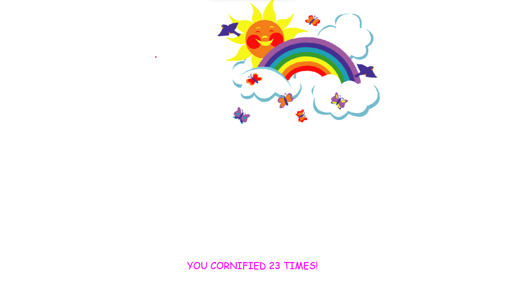

🎮 **Unlocking Easter Eggs with the Konami Code in JavaScript!**

Hello everyone! Today, I want to share a fun piece of code that brings the classic Konami Code to life in JavaScript. For those who don't know, the Konami Code is a sequence of key presses (up, up, down, down, left, right, left, right, B, A) that was originally used to unlock special features in video games.

This is a fun way to add hidden features or easter eggs to your website. Try it out and let me know what you think!

HINT : 'JFARADIQSAM'

[Live Site Link](https://ashraful-fuqha.github.io/konami-code/)